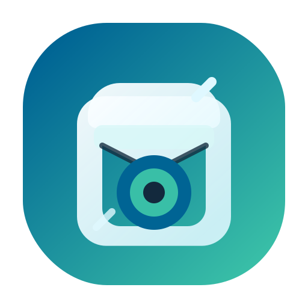

<div align="center">
  
  
  <br/>

  <p align="center">
    <strong>Solusi Cerdas & Minimalis untuk Mengorganisir, Melacak, dan Menemukan Barang Anda.</strong>
  </p>

  <p align="center">
    <a href="https://github.com/MuhammadIsakiPrananda1/barangku-dimana-app/releases/latest">
      
    </a>
    <a href="https://flutter.dev">
      
    </a>
    <a href="https://dart.dev">
      
    </a>
    <a href="LICENSE">
      
    </a>
  </p>

  <p align="center">
    
    
    
    
  </p>

  <p align="center">
    
    
    
  </p>
</div>

<br/>

## 🌟 Filosofi: "Lupakan Rasa Lupa"
**Barangku Dimana** lahir dari kebutuhan sederhana namun krusial: mengakhiri frustrasi saat mencari barang yang "menghilang" di rumah atau kantor kita sendiri. Aplikasi ini bukan sekadar inventaris, melainkan asisten memori visual yang membantu Anda memetakan harta benda Anda dengan presisi.

Di versi **1.3.0 (Zen Mode Update)**, kami merombak total pengalaman pengguna. Kami menghapus distraksi visual untuk memberikan fokus penuh pada fungsi pencarian dan pendataan.

<br/>

## ✨ Fitur Premium
Aplikasi ini dikembangkan dengan fokus pada kecepatan dan kemudahan penggunaan:

- 🧘 **Zen Minimalist UI**: Antarmuka bersih tanpa bayangan (shadow) dan gradasi yang mengganggu. Fokus pada konten dan kecepatan akses.
- 💾 **Safe Local Storage**: Menggunakan SQLite berperforma tinggi. Data Anda 100% aman dan privat di perangkat Anda sendiri.
- 📸 **Visual Inventory**: Lampirkan foto untuk setiap barang. Karena terkadang, satu gambar bercerita lebih banyak dari seribu kata.
- 🎙️ **Voice Command Entry**: Masukkan deskripsi barang lebih cepat menggunakan perintah suara terintegrasi.
- 📊 **Smart Insight Dashboard**: Pantau statistik barang, kategori paling populer, hingga status peminjaman dalam satu layar intuitif.
- 📄 **Professional Reporting**: Ekspor seluruh inventaris ke format **PDF (A4 Ready)** atau **CSV** untuk manajemen data tingkat lanjut.
- 🔍 **Instant QR/Barcode Scanner**: Temukan barang secara instan dengan memindai label QR/Barcode yang Anda tempelkan pada kotak penyimpanan.
- 🔔 **Intelligent Reminders**: Notifikasi pintar untuk garansi barang atau pengingat pengembalian barang yang dipinjam.
- ⚡ **Ultra Lightweight**: Dioptimalkan secara khusus untuk perangkat dengan spesifikasi rendah (HP Kentang Friendly V2) dengan penggunaan GPU minimal.

<br/>

## 🛠️ Stack Teknologi & Arsitektur
Dibuat dengan teknologi mutakhir untuk menjamin keandalan jangka panjang:
- **Core Engine**: [Flutter 3.x](https://flutter.dev/) & [Dart](https://dart.dev/)
- **Database**: [SQLite (sqflite)](https://pub.dev/packages/sqflite) - Relational Data Management.
- **State Management**: [Provider](https://pub.dev/packages/provider) - Reactive & Predictable.
- **Charts Engine**: `fl_chart` untuk visualisasi data interaktif.
- **Reporting**: `pdf` & `printing` untuk generator dokumen lokal.
- **Scanner**: `mobile_scanner` untuk pemindaian responsif.

<br/>

## 🚀 Panduan Penggunaan
1. **Tambah Barang**: Tekan tombol `+`, foto barangnya, beri nama, dan tentukan lokasinya (contoh: "Lemari Hallway - Rak Atas").
2. **Gunakan Pencarian**: Ketik kata kunci di bar pencarian. Lokasi tepat akan muncul seketika.
3. **Scan untuk Mencari**: Cetak label QR, tempel di kotak. Cukup scan kotak tersebut untuk mengetahui isi di dalamnya tanpa membukanya.
4. **Export Laporan**: Gunakan menu export untuk mencetak daftar aset rumah/kantor Anda.

<br/>

## 💻 Panduan Instalasi (Development)
Ingin mengembangkan aplikasi ini lebih lanjut?
```bash
# 1. Clone repository
git clone https://github.com/MuhammadIsakiPrananda1/barangku-dimana-app.git

# 2. Masuk ke direktori
cd barangku-dimana-app

# 3. Ambil dependencies
flutter pub get

# 4. Jalankan aplikasi
flutter run
```

<br/>

## 🤝 Kontribusi & Lisensi
Kontribusi dalam bentuk *bug report*, *feature request*, atau *pull request* sangat dihargai. Silakan baca [CONTRIBUTING.md](CONTRIBUTING.md) untuk detailnya.

Proyek ini menggunakan lisensi **MIT** - lihat file [LICENSE](LICENSE) untuk informasi lebih lanjut.

---
<div align="center">
  <p>Dibuat dengan penuh ketelitian oleh <b>Neverland Studio</b></p>
  
</div>
