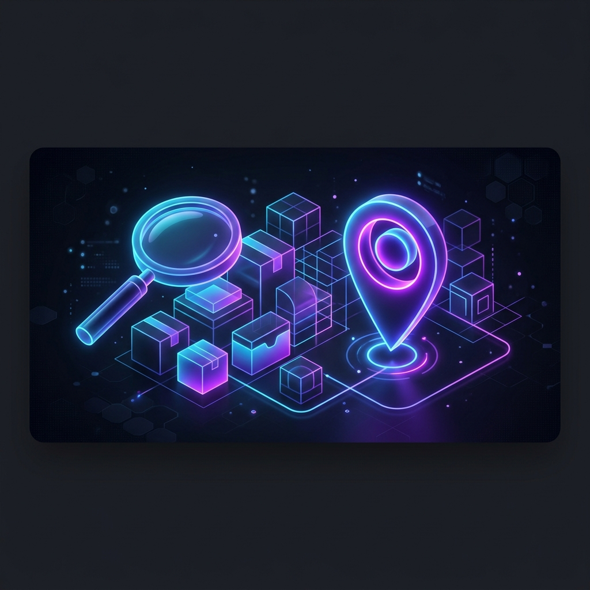

<div align="center">
  
  
  <h1>📦 Aplikasi Barangku Dimana</h1>
  <p><strong>Aplikasi pintar untuk mencatat dan mencari lokasi terakhir barang Anda dengan mudah.</strong></p>

  <p>
    <a href="https://flutter.dev"></a>
    <a href="https://dart.dev"></a>
    <a href="LICENSE"></a>
  </p>

  

  <h3>🚀 Unduh Aplikasi</h3>
  <p align="center">
    <a href="#link-playstore">
      
    </a>
    &nbsp;&nbsp;&nbsp;
    <a href="#link-appstore">
      
    </a>
  </p>
</div>

<br/>

## 🌟 Fitur Utama
Aplikasi **Barangku Dimana** hadir dengan berbagai fitur untuk memudahkan Anda melacak barang:

- s **Penyimpanan Lokal (SQLite)**: Data aman dan dapat diakses secara offline.
- 📸 **Lampiran Foto**: Tambahkan foto barang menggunakan kamera atau galeri.
- 📊 **Visualisasi Data**: Statistik dan chart penggunaan yang interaktif.
- 🖨️ **Ekspor Dokumen**: Cetak data ke PDF atau ekspor ke CSV dengan mudah.
- 📷 **Scanner QR & Barcode**: Pindai label barang yang sudah ada.
- 🎙️ **Voice to Text**: Input nama atau deskripsi barang menggunakan suara.
- 🔔 **Notifikasi Lokal**: Pengingat cerdas untuk barang-barang tertentu.

<br/>

## 🛠️ Teknologi yang Digunakan
Proyek ini dibangun menggunakan teknologi terbaru dan pustaka terbaik dari ekosistem Flutter:
- **Framework**: [Flutter](https://flutter.dev/)
- **Database**: [sqflite](https://pub.dev/packages/sqflite)
- **State Management**: [Provider](https://pub.dev/packages/provider)
- **Animasi & UI**: `flutter_animate`, `shimmer`, `fl_chart`, `cupertino_icons`
- **Utilitas**: `image_picker`, `qr_flutter`, `mobile_scanner`, `speech_to_text`, `pdf`, `csv`

<br/>

## 🚀 Memulai Pengembangan (Getting Started)

Jika Anda ingin berkontribusi atau menjalankan proyek ini di mesin lokal, ikuti langkah-langkah berikut:

### Prasyarat
Pastikan Anda telah menginstal:
- [Flutter SDK](https://flutter.dev/docs/get-started/install) (versi `>=3.0.0`)
- [Android Studio](https://developer.android.com/studio) atau [VS Code](https://code.visualstudio.com/)

### Instalasi

1. **Clone repository ini**
   ```bash
   git clone https://github.com/username/barangku-dimana.git
   cd barangku-dimana
   ```

2. **Unduh dependensi**
   ```bash
   flutter pub get
   ```

3. **Jalankan Aplikasi**
   ```bash
   flutter run
   ```

<br/>

## 🤝 Berkontribusi (Contributing)
Kami sangat menyambut kontribusi dari komunitas! Silakan baca [CONTRIBUTING.md](CONTRIBUTING.md) untuk mempelajari cara berkontribusi, melaporkan bug, atau mengajukan fitur baru. Pastikan Anda juga mengikuti [CODE_OF_CONDUCT.md](CODE_OF_CONDUCT.md).

<br/>

## 📄 Lisensi
Proyek ini dilisensikan di bawah MIT License. Lihat file [LICENSE](LICENSE) untuk detail lebih lanjut.

---
<div align="center">
  Dibuat dengan ❤️ oleh Neverland Studio.
</div>
