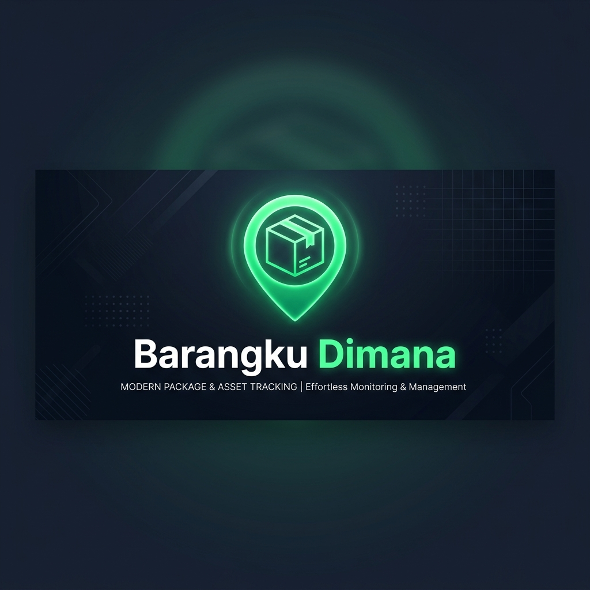

<div align="center">
  
  
  <p align="center">
    <strong>Solusi cerdas untuk melacak, mengorganisir, dan menemukan barang berharga Anda dengan mudah.</strong>
  </p>

  <p align="center">
    <a href="https://flutter.dev"></a>
    <a href="https://dart.dev"></a>
    <a href="LICENSE"></a>
  </p>
</div>

<br/>

## 📖 Tentang Aplikasi
**Barangku Dimana** adalah aplikasi asisten pribadi yang dirancang untuk mengatasi masalah klasik: lupa tempat menaruh barang. Baik itu kunci cadangan, dokumen penting, atau peralatan hobi yang jarang digunakan, aplikasi ini memastikan Anda tahu persis di mana setiap barang berada hanya dalam beberapa ketukan.

Dibangun dengan **Flutter**, aplikasi ini menawarkan performa yang mulus dan antarmuka modern yang sangan intuitif.

<br/>

## ✨ Fitur Unggulan
Aplikasi ini dikemas dengan fitur-fitur premium untuk pengelolaan barang yang maksimal:

- 💾 **Penyimpanan Lokal (SQLite)**: Data Anda sepenuhnya milik Anda. Disimpan secara lokal dan aman, dapat diakses kapan saja tanpa kuota internet.
- 📸 **Visual Library**: Lampirkan foto barang langsung dari kamera atau galeri untuk mempermudah identifikasi visual.
- 🎙️ **Voice Commands**: Malu mengetik? Gunakan fitur *Voice-to-Text* untuk memasukkan nama atau deskripsi barang dengan suara Anda.
- 📊 **Insight & Statistik**: Visualisasi data barang Anda melalui bagan interaktif (FL Chart) untuk melihat distribusi kategori.
- 📄 **Pelaporan Profesional**: Ekspor daftar inventaris Anda ke format **PDF** siap cetak atau file **CSV** untuk kebutuhan pendataan lebih lanjut.
- 🔍 **Smart Scanner**: Dukungan pemindaian QR Code dan Barcode untuk melabeli atau mencari barang secara instan.
- 🔔 **Pengingat Cerdas**: Sistem notifikasi lokal untuk mengingatkan Anda tentang peminjaman barang atau jadwal pembersihan.

<br/>

## 🛠️ Teknologi yang Digunakan
Proyek ini menggunakan stack teknologi modern untuk menjamin stabilitas dan kecepatan:
- **Framework**: [Flutter](https://flutter.dev/) (SDK Versi Terbaru)
- **Database**: [sqflite](https://pub.dev/packages/sqflite) - Database relasional lokal yang tangguh.
- **State Management**: [Provider](https://pub.dev/packages/provider) - Untuk alur data yang bersih dan reaktif.
- **Animations**: `flutter_animate` & `shimmer` untuk pengalaman UI yang premium.
- **Charts**: `fl_chart` untuk visualisasi data yang memukau.

<br/>

## 🚀 Panduan Penggunaan
Bagaimana cara memulai dengan Barangku Dimana?

1. **Tambahkan Inventaris**: Klik tombol tambah (`+`), ambil foto barang, berikan nama, dan tuliskan lokasi penyimpanannya (misal: "Kotak Perkakas A" atau "Lemari Pakaian Baris 2").
2. **Gunakan Pencarian**: Saat Anda butuh barang tersebut, cukup ketik namanya di kolom pencarian. Aplikasi akan menunjukkan detail lokasinya.
3. **Scan Barcode**: Jika Anda memiliki banyak barang serupa, tempelkan label QR/Barcode dan gunakan scanner dalam aplikasi untuk pengecekan cepat.
4. **Cetak Laporan**: Jika Anda ingin melakukan "Stock Opname" rumah atau kantor, gunakan fitur ekspor PDF untuk mendapatkan daftar inventaris yang rapi.

<br/>

## 💻 Instalasi (Developer)
Jika Anda ingin menjalankan atau berkontribusi pada pengembangan aplikasi ini:

1. **Clone Repository**:
   ```bash
   git clone https://github.com/username/barangku-dimana.git
   ```
2. **Setup Flutter**: Pastikan Flutter SDK `>=3.0.0` sudah terpasang di mesin Anda.
3. **Get Dependencies**:
   ```bash
   flutter pub get
   ```
4. **Run Application**:
   ```bash
   flutter run
   ```

<br/>

## 🤝 Kontribusi & Lisensi
Kontribusi sangat terbuka bagi siapa saja! Silakan lihat [CONTRIBUTING.md](CONTRIBUTING.md) untuk detail lebih lanjut. Proyek ini dilisensikan di bawah **MIT License**.

---
<div align="center">
  Dibuat dengan ❤️ oleh <b>Neverland Studio</b>.
</div>
