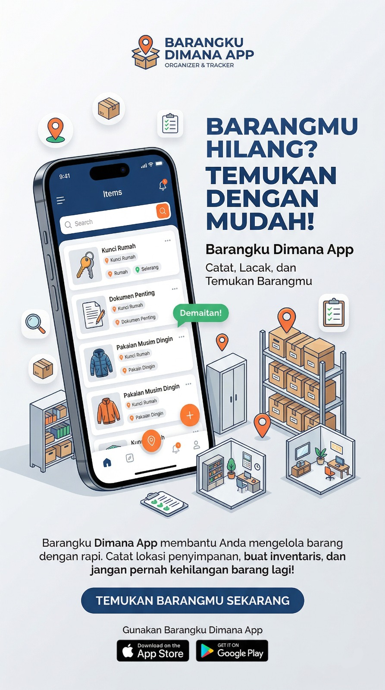

  
  
   

  <h2>🧘‍♂️ Release v1.4.0 — Zen Minimalism Overhaul</h2>

  

    
    
    
  

  
  

    
    
    
  

 

### ✨ Zen Overhaul (Yang Baru)
Versi 1.4.0 membawa filosofi desain **Zen Minimalism** ke tingkat yang lebih ekstrem, menghapus semua gangguan visual untuk memberikan fokus penuh pada pengelolaan barang Anda.

- **Zero-Shadow UI**: Menghapus seluruh efek bayangan (*shadow*) pada kartu barang dan tombol untuk tampilan yang lebih bersih, tajam, dan modern.
- **Flat Surface Logic**: Mengganti gradasi warna dengan warna solid premium (Slate & Emerald) untuk meningkatkan kontras dan kejelasan visual.
- **Micro-UX Refinement**: Penyesuaian garis tepi (*border*) menjadi lebih tipis dan elegan, memberikan kesan aplikasi kelas atas yang ringan.

#### 🚀 Optimasi Performa Maksimal
- **GPU Efficient V2**: Dengan menghilangkan elemen visual yang berat, aplikasi kini berjalan dengan FPS maksimal di seluruh kategori perangkat (HP Kentang Friendly V2).
- **Instant Response Architecture**: Menghapus animasi transisi yang menghambat kecepatan. Sekarang, daftar barang muncul dan merespon sentuhan secara instan.
- **Silky Smooth Theme Switch**: Optimalisasi transisi tema (Light/Dark) agar terasa sangat ringan tanpa beban CPU yang berlebih.

#### 🛠️ Peningkatan & Sinkronisasi
- **Versi 1.4.0**: Sinkronisasi versi aplikasi secara menyeluruh di seluruh komponen sistem (Splash, Home, Gradle, Pubspec).
- **Branding Consistency**: Pembaruan sistem watermark Neverland Studio untuk menjaga estetika "Quiet Luxury" yang konsisten.

---

### 📦 Asset Downloads
Silakan unduh file APK resmi di bawah ini untuk merasakan kecepatan murni dari desain Zen v1.4.0.

> [!TIP]
> Versi ini adalah standar baru untuk kecepatan aplikasi inventaris. Kami telah membuang semua beban visual agar Bapak bisa bekerja lebih cepat tanpa gangguan.

---

  Dibuat dengan ❤️ oleh <b>Muhammad Isaki Prananda</b>

